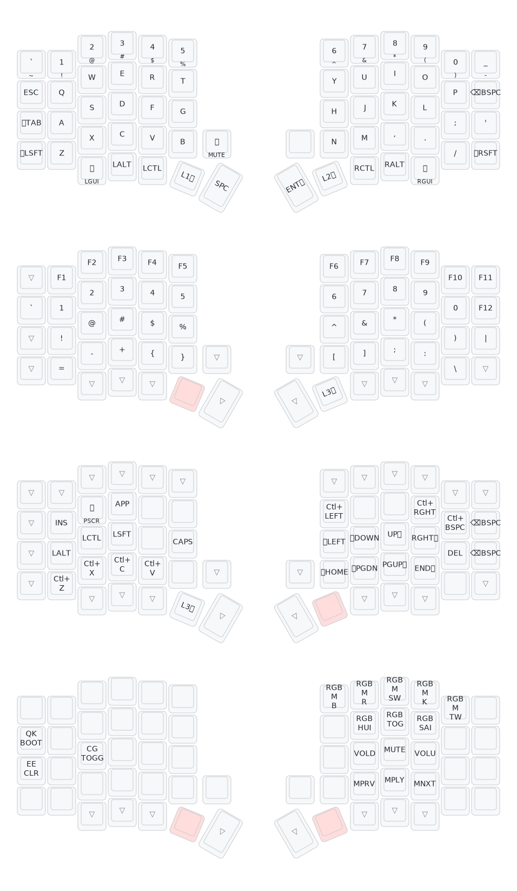
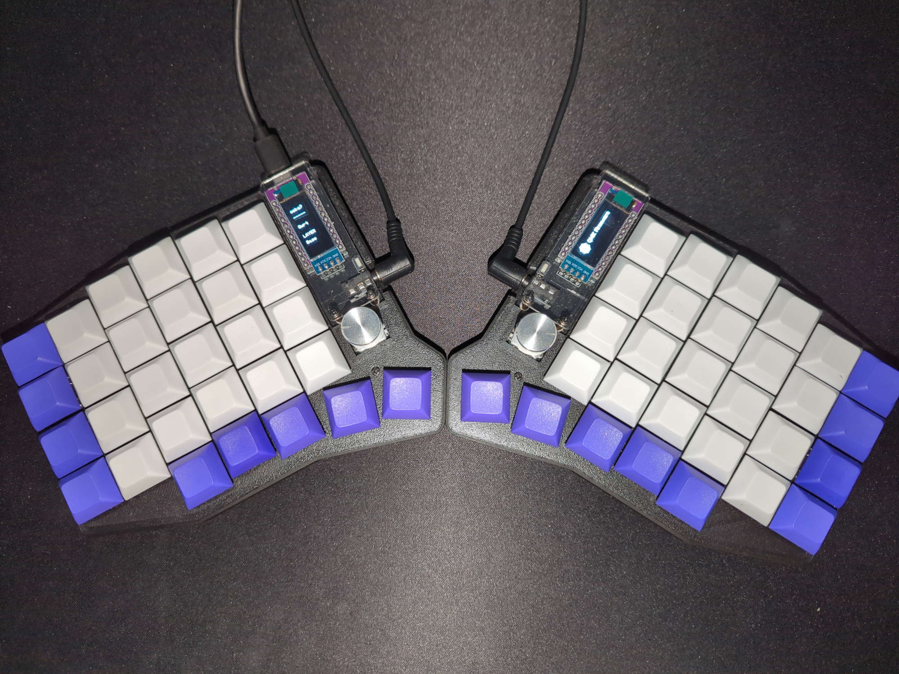
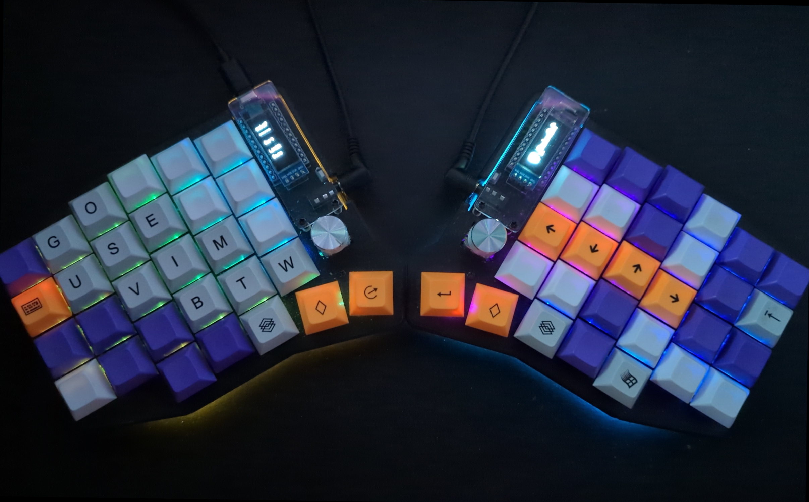
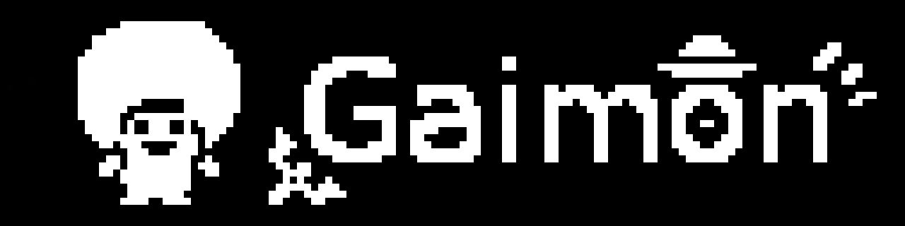

# ⌨️ sofle

QMK config for my Sofle RGB keyboard.

## Keyboard Specs

These are the specs for my keyboard:
- Keyboard: [Sofle](https://github.com/josefadamcik/SofleKeyboard)
- Type: [Sofle RGB](https://josefadamcik.github.io/SofleKeyboard/build_guide_rgb.html)
- Microcontroller: ATmega32U4
- Bootloader: Caterina
- Firmware: [QMK](https://github.com/qmk/qmk_firmware)
- Vendor: [KeebMaker](https://keebmaker.com)
- OLED display: yes (`ssd1306`)
- RGB Lighting: yes
- Rotary Encoders: yes
- QMK keyboard id: `sofle/rev1`
- QMK parent keymap: `rgb_default`

## Layout

This SVG was generated using the wonderful [keymap-drawer](https://github.com/caksoylar/keymap-drawer) tool.

## Images

Keyboard pictures:

Custom OLED pixel art:

